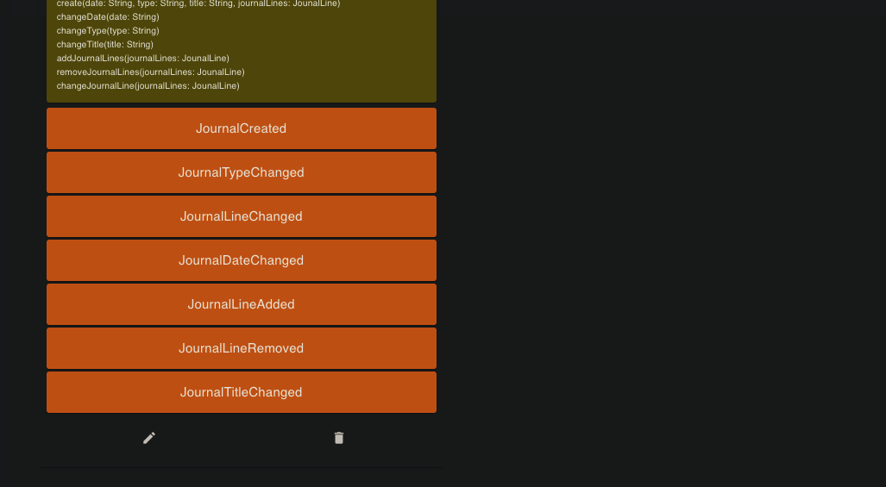

# vlingo-xoom-developer-challenge

On your marks. Set. XOOM! <-- Will keep this here... :)

# Overview

## Vlingo XOOM Designer:

- Customer Context:
  
- Assets Context:
  
  
- Rental Context:
  
- Bank Context:
  
- Employee Context:
  

# Run solution with infrastructure

- First build the solution using:
  `
  ./gradlew build
  `
- Then execute :
  `
  docker-compose -f docker-compose.yml -f docker-compose.override.yml up -d
  `
