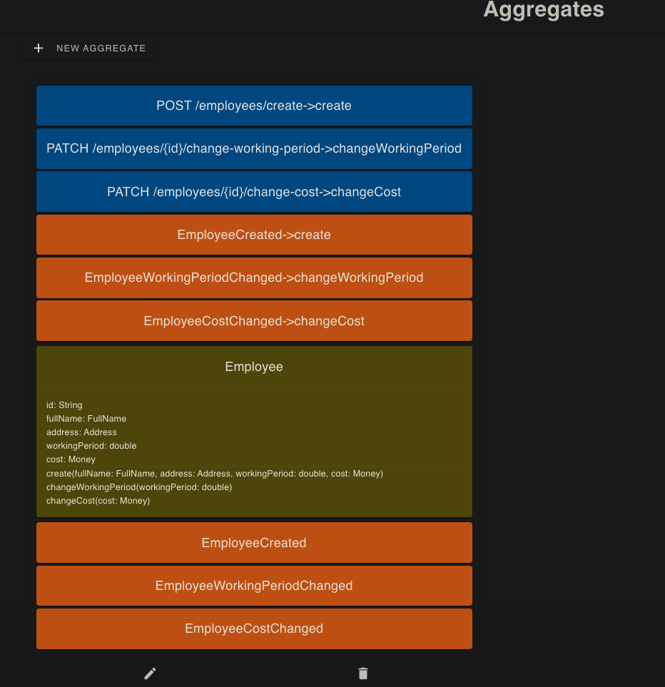

# vlingo-xoom-developer-challenge

## DOMA Accounting Solution

## Table of contents

[1. Overview](#1-Overview)\
[2. Architecture Decision Log](#2-Architecture-Decision-Log)\
[3. Vlingo XOOM Designer - Initial Design](#3-Vlingo-XOOM-Designer---Initial-Design)\
[4. Run solution with infrastructure](#4-Run-solution-with-infrastructure)\
[5. Integration Tests](#5-Integration-Tests)\
[6. Testing the system APIs using curl](#6-Testing-the-system-APIs-using-curl)

## 1. Overview

### Domain - Accounting:

Working with a domain expert (accountant), to build an integrated system focusing on:

- Customers
- Assets
- Rental
- Bank
- Sale
- Purchase
- Employee expenses

## 2. Architecture Decision Log

All Architectural Decisions (AD) are documented in the [Architecture Decision Log (ADL)](docs/architecture-decision-log)
.

## 3. Vlingo XOOM Designer - Initial Design:

- Customer Context:
  
- Assets Context:
  
  
- Rental Context:
  
- Bank Context:
  
  
- Employee Context:
  
- Sale Context:
  
- Purchase Context:
  

### 4. Run solution with infrastructure

- First build the solution using:\
  `
  ./gradlew build
  `
- Run With docker-compose :\
  `
  docker-compose -f docker-compose.yml -f docker-compose.override.yml up -d
  `
- Run With last version of docker :\
  `
  docker compose -f docker-compose.yml -f docker-compose.override.yml up -d
  `
- List Services:\
  `
  docker-compose -f docker-compose.yml -f docker-compose.override.yml ps
  `\
  OR\
  `
  docker compose -f docker-compose.yml -f docker-compose.override.yml ps
  `

```console
                   Name                                 Command               State                                             Ports
--------------------------------------------------------------------------------------------------------------------------------------------------------------------------------
hamzajg-accounting-solution_api-gateway_1    /docker-entrypoint.sh ngin ...   Up      80/tcp, 0.0.0.0:8080->8080/tcp
hamzajg-accounting-solution_assets-api_1     /bin/sh -c java -Dcom.sun. ...   Up      18080/tcp
hamzajg-accounting-solution_bank-api_1       /bin/sh -c java -Dcom.sun. ...   Up      18080/tcp
hamzajg-accounting-solution_customer-api_1   /bin/sh -c java -Dcom.sun. ...   Up      18080/tcp
hamzajg-accounting-solution_employee-api_1   /bin/sh -c java -Dcom.sun. ...   Up      18080/tcp
hamzajg-accounting-solution_purchase-api_1   /bin/sh -c java -Dcom.sun. ...   Up      18080/tcp
hamzajg-accounting-solution_rental-api_1     /bin/sh -c java -Dcom.sun. ...   Up      18080/tcp
hamzajg-accounting-solution_sale-api_1       /bin/sh -c java -Dcom.sun. ...   Up      18080/tcp
rabbitmq                                     docker-entrypoint.sh rabbi ...   Up      15671/tcp, 0.0.0.0:15672->15672/tcp, 25672/tcp, 4369/tcp, 5671/tcp, 0.0.0.0:5672->5672/tcp
```

### 5. Integration Tests:

- Run:\
  `
  ./gradlew test
  `

### 6. Testing the system APIs using curl:

- 5.1. Customer APIs:
    - Create Customer:
  ```console 
      curl --location --request POST 'localhost:8080/api/customers/create' \
      --header 'Content-Type: application/json' \
      --data-raw '{
      "name": "New Style Confection",
      "type": "SARL",
      "activityType" : "Confection",
      "capital": {
      "value": "1000"
      },
      "address": {
      "firstLine": "Address, Road 123",
      "secondLine": ""
      },
      "creationDate": "2000-01-01",
      "legalStatus": {
      "fiscalCode": "1234567",
      "patent": "1234567",
      "commercialRegistry": "1234567"
      },
      "associates": [
      {
      "fullName": "Jack TODO",
      "part": 75,
      "isManager": true }, {
      "fullName": "Jhon Test",
      "part": 25,
      "isManager": false }
      ]
      }'
     ```
    - Add Associates
  ```console
      curl --location --request PATCH 'localhost:8080/api/customers/9dd3963a-e9cc-418c-8af3-7e708ce2e84b/associates/add' \
      --header 'Content-Type: application/json' \
      --data-raw '[
      {
      "fullName": "Patrik Done",
      "part": 15,
      "isManager": false }
      ]'
    ```
    - Remove Associates:
  ```console
      curl --location --request PATCH 'localhost:8080/api/customers/9dd3963a-e9cc-418c-8af3-7e708ce2e84b/associates/remove' \
      --header 'Content-Type: application/json' \
      --data-raw '[
      {
      "fullName": "Patrik Done",
      "part": 15,
      "isManager": false }
      ]'
  ```
    - Get Customer By ID:
  ```console
      curl --location --request GET 'localhost:8080/api/customers/7758c87d-d09d-4347-adbb-8f82d508b9de'
  ```
    - Get All Customers:
  ```console
      curl --location --request GET 'localhost:8080/api/customers/all'
  ```
    - Create Exercise:
  ```console
      curl --location --request POST 'localhost:8080/api/exercises/create' \
      --header 'Content-Type: application/json' \
      --data-raw '{
      "customerId": "1bbc7cab-4c5e-494c-8a70-11d1e2b558e1",
      "startDate": "2020-01-01",
      "endDate": "2020-12-31"
      }'
   ```
    - Get Exercise By ID:
  ```console
      curl --location --request GET 'localhost:8080/api/exercises/d939f04f-7704-4de8-ba87-243a702ed387'
  ```
    - Get All Exercises:
  ```console
      curl --location --request GET 'localhost:8080/api/exercises/all'
  ```

- 5.2. Rental APIs:
    - Create:
  ```console
      curl --location --request POST 'localhost:8080/api/rentals/create' \
      --header 'Content-Type: application/json' \
      --data-raw '{
      "startDate": "2000-01-01",
      "endDate": "2010-12-31",
      "customerId": "9dd3963a-e9cc-418c-8af3-7e708ce2e84b",
      "paymentPeriod": 6,
      "price": {
      "amount": 700,
      "currency": "TND"
      } }'
  ```
    - Get By ID:
  ```console
      curl --location --request GET 'localhost:8080/api/rentals/f07b8785-f936-406d-82cc-448c396f2582'
  ```
    - Get All:
  ```console
      curl --location --request GET 'localhost:8080/api/rentals/all'
  ```
- 5.3. Sale APIs:
    - Create:
  ```console
      curl --location --request POST 'localhost:8080/api/sales/clients/create' \
      --header 'Content-Type: application/json' \
      --data-raw '{
      "name": "Brothers Brand",
      "activityType": "Point of Sale"
      }'
  ```
    - Get By ID:
  ```console
      curl --location --request GET 'localhost:8080/api/sales/clients/f07b8785-f936-406d-82cc-448c396f2582'
  ```
    - Get All:
  ```console
      curl --location --request GET 'localhost:8080/api/sales/clients/all'
  ```
- 5.4. Purchase APIs:
    - Create:
  ```console
      curl --location --request POST 'localhost:8080/api/purchases/vendors/create' \
      --header 'Content-Type: application/json' \
      --data-raw '{
      "name": "Modern fabtic",
      "activityType": "Confection Supplier"
      }'
  ```
    - Get By ID:
  ```console
      curl --location --request GET 'localhost:8080/api/purchases/vendors/2372abee-b9cc-4171-8916-0c653739f273'
  ```
    - Get All:
  ```console
      curl --location --request GET 'localhost:8080/api/purchases/vendors/all'
  ```
- 5.5. Assets APIs:
    - Create Journal:
  ```console
      curl --location --request POST 'localhost:8080/api/assets/create' \
      --header 'Content-Type: application/json' \
      --data-raw '{
      "exerciceId": "d939f04f-7704-4de8-ba87-243a702ed387",
      "date": "2021-04-18",
      "type": "sale",
      "title": "sale for client ",
      "journalLines":[
      {
      "description": "Sale Debit",
      "clientId": "f07b8785-f936-406d-82cc-448c396f2582",
      "debit": {
      "amount": 300,
      "currencty": "TND"
      },
      "credit": {
      "amount": 0 } }, {
      "description": "Sale Credit",
      "clientId": "f07b8785-f936-406d-82cc-448c396f2582",
      "credit": {
      "amount": 300,
      "currencty": "TND"
      },
      "debit": {
      "amount": 0 } }
      ]
      }'
  ```
- 5.6. Bank APIs:
    - Create Bank Account:
  ```console
      curl --location --request POST 'localhost:8080/api/banks/accounts/create' \
      --header 'Content-Type: application/json' \
      --data-raw '{
      "rib":"123",
      "iban":"TN3767822444713685185737",
      "type":"Gold",
      "bicCode":"123",
      "agency":"BIAT",
      "balance": {
      "amount": 10000,
      "currency": "TND"
      } }'
  ```
    - Create Bank Account Journal:
  ```console
      curl --location --request POST 'localhost:8080/api/banks/journals/create' \
      --header 'Content-Type: application/json' \
      --data-raw '{
      "date": "2021-04-18",
      "description": "Client Payment",
      "journalLines": [
      {
      "bankAcountId": "cb8112db-e7aa-4852-b355-16f19704b071",
      "credit": {
      "amount": 500,
      "currency": "TND"
      },
      "debit": {
      "amount": 0 },
      "clientId": "f07b8785-f936-406d-82cc-448c396f2582"
      }
      ]
      }'
  ```
- 5.7. Employee APIs:
    - Create Employee Expenses:
  ```console
      curl --location --request POST 'localhost:8080/api/employees/create' \
      --header 'Content-Type: application/json' \
      --data-raw '{
      "exerciseId": "",
      "fullName": {
      "firstName": "Matt",
      "secondName": "",
      "lastName": "Done"
      },
      "address":{
      "firstLine": "Address, 223"
      },
      "workingPeriod": 10,
      "cost": {
      "amount": 700,
      "currency": "TND"
      } }'
  ```